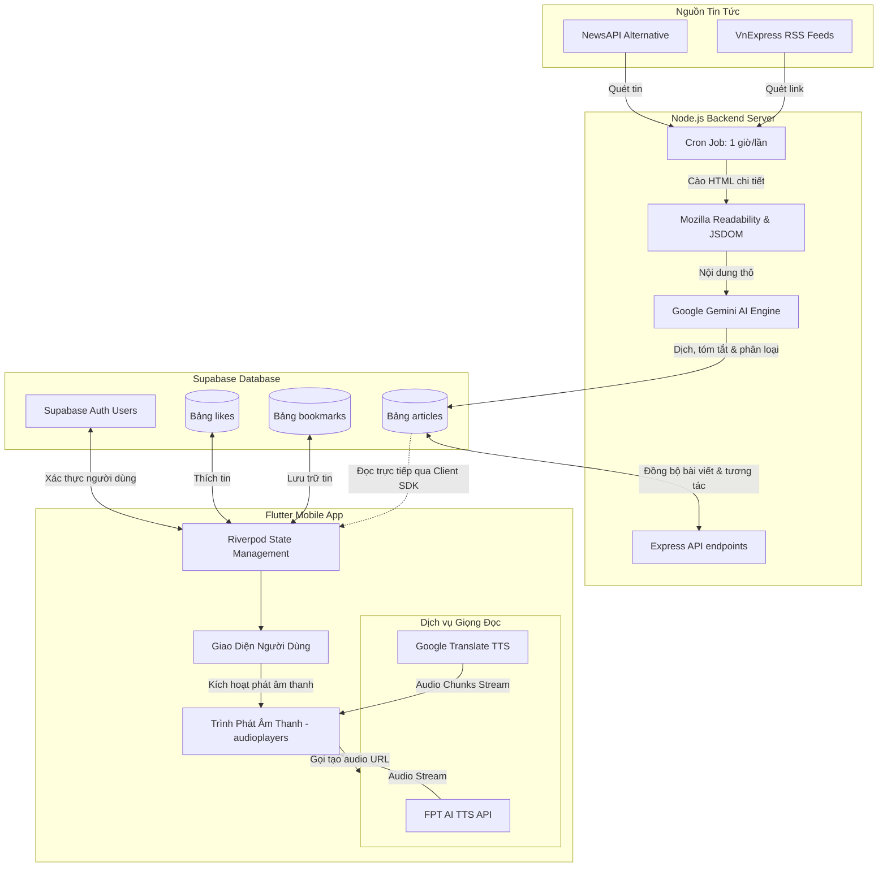

# 🎙️ Báo Xe Ôm (News Enjoy) - Nền Tảng Đọc Báo Âm Thanh Thông Minh Tích Hợp AI

[](https://flutter.dev)
[](https://nodejs.org)
[](https://supabase.com)
[](https://deepmind.google/technologies/gemini/)
[](https://expressjs.com)
[](https://riverpod.dev)

**Báo Xe Ôm (News Enjoy)** là một hệ sinh thái tin tức thông minh toàn diện, kết hợp giữa ứng dụng di động (Flutter) và hệ thống máy chủ tự động hóa (Node.js). Dự án được thiết kế để giải quyết nhu cầu cập nhật tin tức rảnh tay bằng cách tự động thu thập tin tức từ các nguồn RSS uy tín, sử dụng trí tuệ nhân tạo **Google Gemini AI** để dịch thuật, tóm tắt và phân loại, sau đó chuyển đổi thành âm thanh chất lượng cao thông qua các dịch vụ **Text-to-Speech (TTS)** chuyên nghiệp (FPT AI và Google TTS).

---

## 📖 Mục Lục
1. [Tính Năng Nổi Bật](#-tính-năng-nổi-bật)
2. [Kiến Trúc Hệ Thống & Luồng Dữ Liệu](#-kiến-trúc-hệ-thống--luồng-dữ-liệu)
3. [Công Nghệ Sử Dụng](#-công-nghệ-sử-dụng)
4. [Cấu Trúc Thư Mục Dự Án](#-cấu-trúc-thư-mục-dự-án)
5. [Hướng Dẫn Cài Đặt & Cấu Hợp](#-hướng-dẫn-cài-đặt--cấu-hình)
   - [Khởi Tạo Cơ Sở Dữ Liệu (Supabase)](#1-khởi-tạo-cơ-sở-dữ-liệu-supabase)
   - [Cấu Hình & Khởi Chạy Backend](#2-cấu-hình--khởi-chạy-backend)
   - [Cấu Hình & Khởi Chạy Mobile App](#3-cấu-hình--khởi-chạy-mobile-app)
6. [Chi Tiết Kỹ Thuật Đọc Báo Âm Thanh](#-chi-tiết-kỹ-thuật-đọc-báo-âm-thanh)
7. [Bảo Mật & Quy Định (RLS)](#-bảo-mật--quy-định-rls)
8. [Đóng Góp & Giấy Phép](#-đóng-góp--giấy-phép)

---

## 🌟 Tính Năng Nổi Bật

### 📱 Ứng Dụng Di Động (Flutter App)
- **Trải Nghiệm Đọc Báo Âm Thanh Rảnh Tay**: Nghe nội dung bài viết đầy đủ hoặc bản tóm tắt thông qua trình phát nhạc tích hợp.
- **Tùy Chọn Đa Giọng Đọc (Multi-TTS Engine)**:
  - **FPT AI TTS**: Giọng đọc tự nhiên, chuẩn vùng miền (Bắc, Trung, Nam), tốc độ điều chỉnh linh hoạt.
  - **Google TTS**: Phát trực tuyến nhanh chóng, cơ chế phân tách câu thông minh vượt giới hạn ký tự.
- **Giao Diện Hiện Đại & Sang Trọng**: Tông màu kem và xanh navy chủ đạo (Cream & Navy Theme) tạo cảm giác dễ chịu khi đọc tin tức. Sử dụng hiệu ứng shimmer tải trang mượt mà.
- **Hệ Thống Thành Viên (Authentication)**: Đăng ký, đăng nhập và quản lý tài khoản an toàn qua Supabase Auth.
- **Tương Tác Cá Nhân Hóa**: Yêu thích (Like), lưu trữ (Bookmark) các bài viết để đọc và nghe lại offline hoặc trong danh sách lưu trữ.
- **Chia Sẻ Nhanh Chóng**: Tích hợp chia sẻ liên kết bài viết trực tiếp qua mạng xã hội (`share_plus`).

### 🌐 Hệ Thống Máy Chủ (Node.js Backend)
- **Đường Ống Crawl Tin Tự Động (Dual-Pipeline)**:
  - **RSS Scraper**: Tự động quét 15 chuyên mục của VnExpress định kỳ.
  - **NewsAPI**: Luồng dự phòng thu thập tin tức quốc tế và các nguồn thay thế.
- **Trích Xuất Nội Dung Chi Tiết (Full-text Extraction)**: Sử dụng **Mozilla Readability** và **JSDOM** để bóc tách nội dung chính của bài viết, loại bỏ quảng cáo, menu và các thành phần thừa từ trang gốc.
- **Trí Tuệ Nhân Tạo Xử Lý Tin Tức (Gemini AI)**:
  - Tự động dịch thuật các tin tức tiếng nước ngoài sang tiếng Việt trôi chảy.
  - Viết lại tiêu đề ngắn gọn, thu hút.
  - Tóm tắt bài viết cô đọng, dễ hiểu.
  - Tự động phân loại chuyên mục chính xác.
- **Tự Động Hóa Với Cron Job**: Lập lịch chạy tự động mỗi giờ (`node-cron`) để thu thập và cập nhật tin tức liên tục.
- **Bảng Quản Trị Trực Quan (Web Dashboard)**: Cung cấp giao diện HTML đơn giản để xem trước các bài viết đã được crawl và xử lý trong database.

---

## 🏗️ Kiến Trúc Hệ Thống & Luồng Dữ Liệu

Luồng xử lý từ lúc tin tức xuất hiện trên báo chính thống cho đến khi phát qua loa hoặc tai nghe của người dùng:



---

## 💻 Công Nghệ Sử Dụng

### Frontend (Mobile & Web Support)
- **Framework**: [Flutter](https://flutter.dev) (SDK ^3.10.7)
- **Quản lý trạng thái (State Management)**: `flutter_riverpod` (Riverpod v3)
- **Trình phát âm thanh (Audio Player)**: `audioplayers` (hỗ trợ phát stream từ URL và luồng byte trực tiếp)
- **Tải & Cache hình ảnh**: `cached_network_image`
- **Tương tác mạng**: `supabase_flutter`, `http`
- **Tiện ích UI**: `shimmer` (hiệu ứng loading), `carousel_slider` (tin nổi bật), `google_fonts` (phông chữ Outfit hiện đại), `cupertino_icons`

### Backend (Node.js Service)
- **Runtime**: [Node.js](https://nodejs.org/) (Express framework)
- **Trí tuệ nhân tạo (AI)**: `@google/generative-ai` (sử dụng dòng mô hình Gemini để dịch thuật và tóm tắt)
- **Cào dữ liệu (Scraper)**: `@mozilla/readability`, `jsdom`, `rss-parser`, `axios`
- **Đặt lịch tự động**: `node-cron`
- **Kết nối Database**: `pg` (PostgreSQL Client kết nối trực tiếp đến Supabase)

### Database & Cloud Service
- **Platform**: [Supabase](https://supabase.com/)
- **Cơ sở dữ liệu**: PostgreSQL (hỗ trợ lưu trữ quan hệ, lập chỉ mục tìm kiếm và bảo mật mức dòng RLS)
- **Xác thực (Auth)**: Supabase Auth (Quản lý phiên đăng nhập của người dùng qua JWT)

---

## 📁 Cấu Trúc Thư Mục Dự Án

```text
newxeom/
├── android/                   # Cấu hình dự án Android
├── ios/                       # Cấu hình dự án iOS
├── assets/                    # Hình ảnh, logo của ứng dụng
│   ├── NEWS.jpg
│   └── XEOMLOGO.jpg           # Logo Báo Xe Ôm
├── backend/                   # Mã nguồn Node.js Backend
│   └── backend/
│       ├── public/            # Giao diện web tĩnh của Backend
│       ├── src/
│       │   ├── scraper/       # Bộ máy cào dữ liệu (RSS, Readability)
│       │   ├── aiService.js   # Tích hợp Gemini AI dịch & tóm tắt
│       │   ├── db.js          # Khởi tạo bảng và kết nối PostgreSQL
│       │   ├── index.js       # Điểm khởi chạy máy chủ Express & Cron Job
│       │   └── newsService.js # Tích hợp luồng tin NewsAPI phụ trợ
│       ├── .env.example       # File cấu hình biến môi trường mẫu
│       └── package.json
├── lib/                       # Mã nguồn Flutter Frontend
│   ├── models/                # Lớp dữ liệu (Article, User...)
│   ├── providers/             # Định nghĩa Riverpod Providers (Auth, News, Bookmarks)
│   ├── screens/               # Các màn hình chính (Home, Detail, Profile, Auth...)
│   ├── services/              # Các dịch vụ kết nối ngoại vi (TTS, Supabase, Interaction...)
│   │   ├── auth_service.dart
│   │   ├── fpt_tts_service.dart
│   │   ├── google_tts_service.dart
│   │   ├── google_tts_web_player.dart
│   │   └── news_service.dart
│   ├── utils/                 # Theme, hằng số cấu hình hệ thống
│   ├── widgets/               # Các widget tái sử dụng (News Card, Custom Button...)
│   └── main.dart              # Điểm khởi chạy ứng dụng Flutter
├── pubspec.yaml               # Quản lý thư viện Flutter & Cấu hình Assets, Splash, Icon
└── README.md                  # Hướng dẫn dự án chuyên nghiệp
```

---

## 🚀 Hướng Dẫn Cài Đặt & Cấu Hình

### 1. Khởi Tạo Cơ Sở Dữ Liệu (Supabase)
Truy cập vào trang quản trị [Supabase Console](https://supabase.com), tạo một dự án mới và chạy đoạn mã SQL dưới đây trong phần **SQL Editor** để khởi tạo cấu trúc bảng:

```sql
-- 1. Tạo bảng lưu trữ bài viết (articles)
CREATE TABLE IF NOT EXISTS articles (
    id SERIAL PRIMARY KEY,
    url TEXT UNIQUE NOT NULL,
    original_title TEXT,
    title_vi TEXT,
    summary_vi TEXT,
    category TEXT,
    published_at TIMESTAMP,
    created_at TIMESTAMP DEFAULT CURRENT_TIMESTAMP,
    source_name TEXT,
    author TEXT,
    url_to_image TEXT,
    full_content_vi TEXT
);

-- Tạo chỉ mục (index) tăng tốc truy vấn cho danh sách tin mới nhất
CREATE INDEX IF NOT EXISTS idx_articles_published_at ON articles (published_at DESC);
CREATE INDEX IF NOT EXISTS idx_articles_category ON articles (category);

-- 2. Tạo bảng quản lý tin đã lưu (bookmarks)
CREATE TABLE IF NOT EXISTS bookmarks (
    id SERIAL PRIMARY KEY,
    user_id UUID NOT NULL REFERENCES auth.users(id) ON DELETE CASCADE,
    article_id INT NOT NULL REFERENCES articles(id) ON DELETE CASCADE,
    created_at TIMESTAMP DEFAULT CURRENT_TIMESTAMP,
    UNIQUE(user_id, article_id)
);

-- 3. Tạo bảng quản lý lượt thích (likes)
CREATE TABLE IF NOT EXISTS likes (
    id SERIAL PRIMARY KEY,
    user_id UUID NOT NULL REFERENCES auth.users(id) ON DELETE CASCADE,
    article_id INT NOT NULL REFERENCES articles(id) ON DELETE CASCADE,
    created_at TIMESTAMP DEFAULT CURRENT_TIMESTAMP,
    UNIQUE(user_id, article_id)
);
```

### 2. Cấu Hình & Khởi Chạy Backend
Di chuyển vào thư mục backend và thiết lập môi trường:

```bash
cd backend/backend
```

Tạo file `.env` dựa trên file `.env.example` hoặc mẫu bên dưới:

```env
PORT=3000
# Link kết nối PostgreSQL từ Supabase (lấy tại Project Settings > Database > Connection String > URI)
DATABASE_URL=postgresql://postgres:[PASSWORD]@[HOST]:5432/postgres
# API Key của Google Gemini AI
GEMINI_API_KEY=your_gemini_api_key_here
# API Key dự phòng của NewsAPI (nếu có)
NEWS_API_KEY=your_news_api_key_here
```

Cài đặt thư viện và khởi chạy máy chủ:

```bash
# Cài đặt các gói phụ thuộc
npm install

# Chạy ở chế độ phát triển (Auto-run & test các luồng quét tin ngay lập tức)
npm run dev
```

> **Lưu ý**: Khi khởi động lần đầu, hệ thống sẽ tự động chạy thử `runScraperPipeline()` (RSS Scraper) và `processNews()` (NewsAPI) để thu thập tin ngay lập tức, sau đó thiết lập lịch tự động quét mỗi 1 tiếng/lần. Bạn có thể truy cập `http://localhost:3000` trên trình duyệt để xem giao diện dashboard của các bài viết đã quét.

### 3. Cấu Hình & Khởi Chạy Mobile App
Đảm bảo bạn đã cài đặt Flutter SDK bản ổn định (v3.10.7 hoặc mới hơn).

1. Mở file `lib/main.dart` và cập nhật thông tin khởi tạo kết nối Supabase của riêng bạn nếu muốn thay đổi môi trường:
   ```dart
   await Supabase.initialize(
     url: 'https://your-supabase-project.supabase.co',
     anonKey: 'your-anon-key',
   );
   ```

2. Tải các gói phụ thuộc của Flutter:
   ```bash
   flutter pub get
   ```

3. (Tùy chọn) Nếu bạn cập nhật logo (`assets/XEOMLOGO.jpg`) và muốn tạo lại Splash Screen hoặc Launcher Icon:
   ```bash
   # Tạo lại biểu tượng ứng dụng
   flutter pub run flutter_launcher_icons
   
   # Tạo lại màn hình chào khởi tạo ứng dụng (Splash Screen)
   flutter pub run flutter_native_splash:create
   ```

4. Khởi chạy ứng dụng di động:
   ```bash
   # Chạy trên thiết bị giả lập hoặc thiết bị thật đang kết nối
   flutter run
   ```

---

## 🎙️ Chi Tiết Kỹ Thuật Đọc Báo Âm Thanh

Hệ thống được lập trình tối ưu hóa trải nghiệm nghe báo một cách thông minh và trôi chảy nhất:

### 1. Giải Pháp Vượt Giới Hạn Ký Tự Của Google TTS
Thông thường, API dịch thuật phát âm của Google Translate giới hạn tối đa **200 ký tự** cho mỗi lượt yêu cầu. Để giải quyết vấn đề này mà không cần đăng ký tài khoản trả phí Google Cloud, `GoogleTranslateTtsService` triển khai thuật toán tách văn bản thông minh (`_splitText`):
- Hệ thống ưu tiên cắt nhỏ văn bản dựa trên các dấu chấm câu (`.`, `!`, `?`) để tạo ra các điểm ngắt câu tự nhiên khi phát âm.
- Đối với những câu quá dài (vượt quá 200 ký tự), hệ thống tự động dò tìm vị trí các khoảng trắng gần nhất để cắt nhỏ câu mà không làm mất từ hoặc ngắt giọng đột ngột ở giữa từ.
- Các đoạn nhỏ được tải trực tuyến tuần tự và liên tục phát thông qua trình lắng nghe sự kiện hoàn thành (`onPlayerStateChanged.listen`) của `AudioPlayer`, tạo cảm giác nghe liền mạch, không bị gián đoạn.

### 2. Tích Hợp FPT AI TTS Chuyên Nghiệp
Đối với người dùng muốn có trải nghiệm giọng đọc cao cấp và chuyên nghiệp hơn, ứng dụng tích hợp sẵn dịch vụ giọng nói của **FPT AI**:
- Cho phép lựa chọn nhiều giọng đọc nổi tiếng (giọng nam/nữ, giọng miền Nam/Trung/Bắc).
- Có thanh trượt điều chỉnh tốc độ đọc (0.8x đến 1.2x) trực tiếp trên giao diện trình phát.
- Do FPT AI xử lý sinh file âm thanh bất đồng bộ (Asynchronous Generation), dịch vụ `FptTtsService` tích hợp cơ chế kiểm tra định kỳ thông minh (Polling với 40 lần thử, mỗi lần cách nhau 3 giây) kèm giải pháp fallback tự động trên môi trường Web để đảm bảo tệp tin âm thanh đã sẵn sàng hoàn toàn trên máy chủ trước khi bắt đầu tải về phát, tránh hiện tượng lỗi luồng phát âm thanh hoặc trễ tiếng.

---

## 🔒 Bảo Mật & Quy Định (RLS)
Để đảm bảo trải nghiệm lưu bài viết (`bookmarks`) và thích bài viết (`likes`) của mỗi người dùng là độc lập và bảo mật, bạn nên kích hoạt chế độ bảo mật dòng **Row Level Security (RLS)** trên bảng điều khiển Supabase cho hai bảng này:

- **Bảng `bookmarks`**:
  - `SELECT`: Chỉ cho phép người dùng đọc dữ liệu của chính họ (`auth.uid() = user_id`).
  - `INSERT`: Chỉ cho phép thêm bản ghi nếu `user_id` khớp với tài khoản đang đăng nhập (`auth.uid() = user_id`).
  - `DELETE`: Chỉ cho phép xóa bản ghi của chính họ (`auth.uid() = user_id`).

- **Bảng `likes`**:
  - Cấu hình tương tự để tránh việc người dùng sửa đổi hoặc xem thông tin lượt thích của người dùng khác một cách trái phép.

---

## 🤝 Đóng Góp & Giấy Phép
Dự án được xây dựng với mục tiêu học tập và phát triển cộng đồng. Mọi ý kiến đóng góp, báo lỗi (Issues) hoặc yêu cầu kéo mã nguồn (Pull Requests) đều được chào đón.

- **Giấy phép**: Phát hành dưới giấy phép MIT. Tự do sử dụng, chỉnh sửa và phân phối cho mục đích phi thương mại hoặc thương mại.

---
*Chúc bạn có những trải nghiệm nghe báo tuyệt vời và thư giãn cùng Báo Xe Ôm.*
